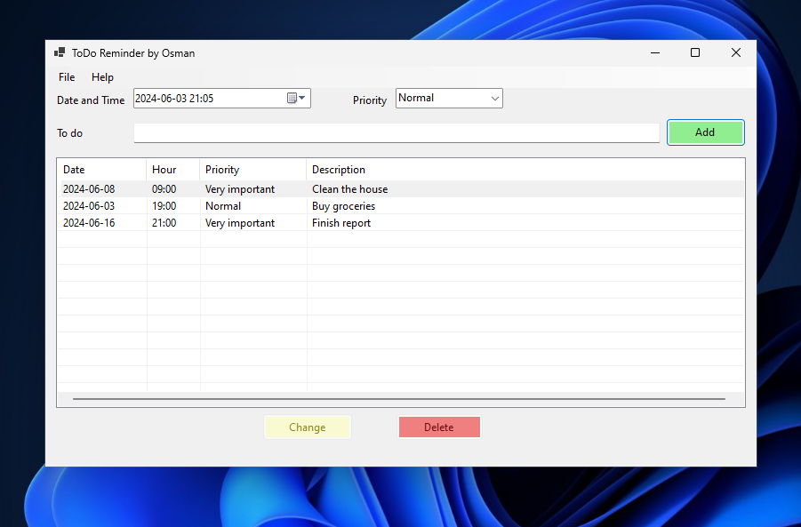

## ToDo Reminder Application

### Overview

The ToDo Reminder application is a simple Windows Forms desktop application designed to help users manage their tasks efficiently. Users can add, edit, and delete tasks with specific priorities and due dates.

### Features

- **Add Tasks**: Users can add new tasks with a specified date, time, priority, and description.
- **Edit Tasks**: Users can modify existing tasks to update their details.
- **Delete Tasks**: Users can remove tasks from the list.
- **Task Prioritization**: Tasks can be categorized based on their priority (Normal, Important, Very Important).
- **Save and Load Tasks**: Users can save the current list of tasks to a file and load tasks from a file using the "Save to file" and "Read from file" options in the File menu.

### Technologies Used

- **C#**: The primary programming language used for this application.
- **.NET 8**: Utilized for building the Windows Forms application.
- **Windows Forms**: Used for designing the graphical user interface (GUI).

### Screenshots

<div style="display: flex; justify-content: space-between;">
    
</div>

### Classes

#### FileManager.cs

- **FileManager**: Manages file operations for saving and reading tasks.
  - **Methods**:
    - `SaveTaskListToFile(List<Task> taskList, string fileName)`: Saves the task list to a file.
    - `ReadTaskListFromFile(List<Task> taskList, string fileName)`: Reads the task list from a file.

#### TaskManager.cs

- **TaskManager**: Manages a list of tasks.
  - **Methods**:
    - `AddTask(Task task)`: Adds a task to the list.
    - `ChangeTask(int index, Task task)`: Changes a task in the list.
    - `DeleteTask(int index)`: Deletes a task from the list.
    - `GetTasksAsString()`: Gets the list of tasks as strings.
    - `GetTasks()`: Gets the list of tasks.
    - `WriteDataToFile(string fileName)`: Writes the task list to a file.
    - `ReadDataFromFile(string fileName)`: Reads the task list from a file.

### How to Run

1. **Clone the repository**:
   ```bash
   git clone https://github.com/Umid0vic/ToDoReminder.git
   ```

2. **Open the solution in Visual Studio**:
   ```bash
   ToDoReminder.sln
   ```

3. **Build the solution**:
   - Go to `Build` -> `Build Solution` or press `Ctrl+Shift+B`.

4. **Run the application**:
   - Press `F5` or go to `Debug` -> `Start Debugging`.

### How to Use

1. **Adding a Task**:
   - Enter the date and time, select the priority, and provide a description in the respective fields.
   - Click the "Add" button to add the task to the list.

2. **Editing a Task**:
   - Select the task from the list that you want to edit.
   - Modify the details as needed.
   - Click the "Change" button to save the changes.

3. **Deleting a Task**:
   - Select the task from the list that you want to delete.
   - Click the "Delete" button to remove the task from the list.

4. **Saving Tasks to a File**:
   - Go to the `File` menu and select `Save to file` to save the current list of tasks to a file.

5. **Loading Tasks from a File**:
   - Go to the `File` menu and select `Read from file` to load tasks from a previously saved file.